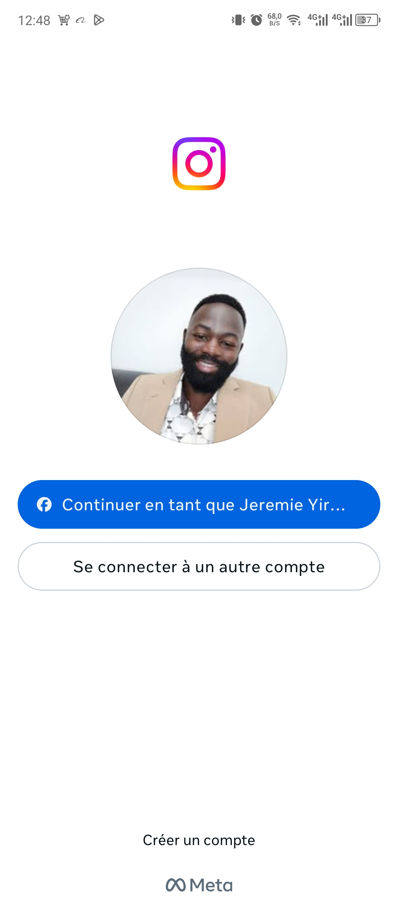
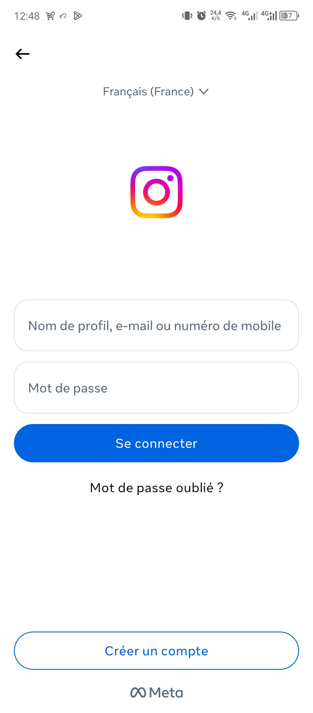

# Instagram Clone Flutter

Un clone simplifié d'Instagram développé avec Flutter. Le projet permet :

- Une authentification simple (locale)
- Un feed d’images chargées depuis l’API Unsplash
- Un système de likes persistant (SharedPreferences)
- Une interface inspirée de celle d’Instagram

## Prérequis

- [Flutter SDK](https://docs.flutter.dev/get-started/install) (version recommandée : >= 3.10.0)
- Android Studio ou VS Code (avec Flutter/Dart plugins)
- Java 17 ou 20 (Éviter Java 21 avec AGP < 8.2.1)
- Un compte Unsplash Developer pour récupérer une clé API

## Installation & Lancement

1. Clonez le projet

   - bash
     git clone https://github.com/Wacher5442/instagram_clone.git
     cd instagram_clone

2. Installez les dépendances

flutter pub get

3. Ajoutez votre clé API Unsplash

Dans lib/core/constants/app_constants.dart, remplacez :
static const unsplashAccessKey = 'VOTRE_CLE_API';

4. Lancez l'application

```plaintext
{
  'muser1': 'mpassword1',
  'muser2': 'mpassword2',
  'muser3': 'mpassword3',
}
```

## Structure du projet

```plaintext
lib/
├── blocs/               # Gestion des états avec BLoC
│   ├── auth/
│   └── feed/
├── core/                # Constantes et utilitaires
├── models/              # Modèles de données
├── repositories/        # Intégration API Unsplash
├── screens/             # Écrans principaux (login, feed)
└── widgets/             # Composants réutilisables
```

## Choix techniques

1. Architecture : BLoC : Séparation des responsabilités, testabilité, évolutivité
2. Stockage Likes : SharedPreferences : Persistant local simple et rapide
3. Navigation : Navigator classique : Suffisant pour un projet mono-écran
4. Responsiveness : ScrollController + Lazy Loading : Comportement réaliste du feed Instagram

## Captures d'ecrans de l'app mobile récente Android utiliser pour le design

1. Premier écran
   

2. Deuxième écran
   

3. Troisième écran
   

## Auteur

Jérémie YEO

Concepteur de Systèmes d'Informations, Développeur mobile
